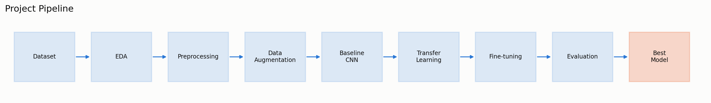

# Flower Image Classification with Deep Learning (Oxford Flowers 102)

[](https://github.com/AnaNicuesa/Flowers/actions/workflows/tests.yml)

A professional, reproducible deep learning project that classifies images of flowers into
102 fine-grained species using TensorFlow and transfer learning.

> Status: Complete. Data exploration, preprocessing, model training, and evaluation are all done — see Results below.

## Table of Contents

- [Project Overview](#project-overview)
- [Business Motivation](#business-motivation)
- [Dataset](#dataset)
- [Repository Structure](#repository-structure)
- [Setup](#setup)
- [Usage](#usage)
- [Results](#results)
- [Model Card](#model-card)
- [Deployment & Monitoring](#deployment--monitoring)
- [Project Presentation](#project-presentation)
- [License](#license)

## Project Overview

This project builds an image classifier for the [Oxford Flowers 102](https://www.robots.ox.ac.uk/~vgg/data/flowers/102/)
dataset using a transfer-learning approach in TensorFlow/Keras. It is designed as a
portfolio-quality demonstration of an end-to-end deep learning workflow: data exploration,
preprocessing, augmentation, model training, evaluation, and business framing.



## Business Motivation

Automated flower identification has practical applications in botanical research,
agriculture, horticulture retail, biodiversity monitoring, and consumer plant-identification
apps. A reliable classifier reduces the need for manual taxonomic expertise and enables
scale (e.g., mobile apps, e-commerce cataloging, citizen-science tools).

## Dataset

- **Source:** Oxford Flowers 102 (Nilsback & Zisserman, 2008)
- **Classes:** 102 flower categories, naturally imbalanced (40–258 images per class)
- **Images:** 8,189 total
- **Access:** via `tensorflow-datasets` (`tfds.load("oxford_flowers102")`)
- **Split:** a custom **stratified 80/10/10** train/validation/test split (6,551 /
  819 / 819 images), not the dataset's official split. The official TFDS split
  allocates a uniform 10 images per class to train and validation and pushes all
  of the natural class imbalance into its test set — which hides that imbalance
  from EDA and leaves too little data to train a CNN from scratch. See
  `docs/architecture.md` for the full rationale.
- **Verified, not assumed:** the split is stratified and **reproducible**
  (identical on rerun with the same seed — `tests/test_data.py`), and the
  train/validation/test index sets are provably **disjoint** by construction.
- **Not benchmark-comparable, by design:** because of the custom split above,
  the accuracy numbers in this repository should **not** be quoted alongside
  published Oxford Flowers 102 leaderboard results, which use the official
  split. This project optimizes for a fair from-scratch-vs-transfer-learning
  comparison and a realistic amount of training data, not for benchmark
  comparability.

## Repository Structure

```
Flowers/
├── data/               # Raw and processed data (not versioned; see data/README.md)
├── notebooks/          # Exploratory and step-by-step development notebooks
├── src/                # Reusable, importable source code (data, models, evaluation, utils)
├── models/             # Saved model checkpoints/artifacts (not versioned)
├── reports/            # Generated figures and evaluation reports
├── app/                # Lightweight demo app for interactive inference
├── docs/               # Business case, model card, architecture notes
├── presentations/      # LaTeX Beamer project presentation
├── tests/              # Unit tests for src/
├── requirements.txt
├── requirements-lock.txt  # exact pinned versions for full reproducibility
├── LICENSE
└── README.md
```

## Setup

```bash
python -m venv .venv
source .venv/bin/activate
pip install -r requirements.txt
```

For a fully reproducible environment (exact versions this project was
developed and tested against), use `requirements-lock.txt` instead:

```bash
pip install -r requirements-lock.txt
```

## Usage

### Run the notebooks (in numerical order)

The four notebooks must be run in order — `04_evaluation.ipynb` loads model
files that only `03_model_training.ipynb` produces; `01`, `02`, and `03` don't
depend on each other's outputs, but numerical order matches how the project is
meant to be read. See `notebooks/README.md` for exactly what each notebook
requires as input and produces as output.

```bash
source .venv/bin/activate
jupyter notebook notebooks/
```

Or run headless, end-to-end, from the command line:

```bash
jupyter nbconvert --to notebook --execute --inplace notebooks/01_data_exploration.ipynb
jupyter nbconvert --to notebook --execute --inplace notebooks/02_preprocessing_augmentation.ipynb
jupyter nbconvert --to notebook --execute --inplace notebooks/03_model_training.ipynb   # produces the model files; CPU-only takes ~2.5h
jupyter nbconvert --to notebook --execute --inplace notebooks/04_evaluation.ipynb       # requires 03's model files to already exist
```

### Run the tests

```bash
pytest tests/ -v
```

### Run the demo app

```bash
streamlit run app/app.py
```

Requires a trained model checkpoint in `models/checkpoints/` — either run
`03_model_training.ipynb` yourself, or download the pretrained checkpoint from
[GitHub Releases](https://github.com/AnaNicuesa/Flowers/releases) (model
weights aren't tracked in git; see `models/README.md`).

### Where things get saved

- **Model checkpoints** (`.keras` files, produced by `03_model_training.ipynb`):
  `models/checkpoints/` — gitignored (large binaries), available instead via
  [GitHub Releases](https://github.com/AnaNicuesa/Flowers/releases).
- **Generated figures** (every `NN_*.png` referenced throughout this README and
  the notebooks): `reports/figures/` — gitignored, regenerated by re-running
  the notebooks.
- **Training history** (`.json`, one per model): `reports/`.

## Results

Test-set results (819 held-out images, this project's custom stratified 80/10/10
split — see Dataset above), from `notebooks/04_evaluation.ipynb`:

| Model | Test accuracy | Macro precision | Macro recall | Macro F1 |
|---|---|---|---|---|
| Baseline CNN (from scratch) | 60.0% | 60.6% | 55.9% | 55.0% |
| EfficientNetB0 transfer (frozen backbone) | 94.4% | 95.1% | 93.2% | 93.6% |
| **EfficientNetB0 transfer (fine-tuned)** | **95.8%** | **96.5%** | **94.9%** | **95.2%** |

- **Transfer learning beats training from scratch by ~36 points of accuracy** —
  the headline result the project is built around (see `docs/architecture.md`).
  Even with a realistic ~6,551-image training set (not the artificial 10/class
  official split), a CNN trained from scratch on 102 fine-grained, imbalanced
  classes tops out well below a pretrained backbone.
- **Fine-tuning produces a modest but consistent improvement** on both
  validation and test performance (94.4% → 95.8% test accuracy). Unfreezing
  a small part of the backbone at a low learning rate improves adaptation to
  the flower dataset without substantially disrupting the pretrained
  representation. The fine-tuned model is used in the demo app.
- **The confidence threshold used in the demo app was chosen on validation
  data only** (92.1% coverage, 98.9% accuracy there at threshold 0.7), then
  confirmed once — not tuned — on the test set (91.9% coverage, 98.5%
  accuracy), so the reported test numbers above stay a genuine held-out
  estimate.
- Errors concentrate in a small number of visually similar species pairs
  rather than being spread uniformly across all 102 classes — see
  `reports/figures/04_most_confused_pairs.png` and
  `reports/figures/04_per_class_f1_extremes.png`.

Full training curves, confusion analysis, and sample predictions (correct and
incorrect) are in `reports/figures/` and `notebooks/03_model_training.ipynb` /
`notebooks/04_evaluation.ipynb`.

## Model Card

Full model details, intended use, evaluation results, and ethical
considerations are in [`docs/model_card.md`](docs/model_card.md).

## Deployment & Monitoring

This project ships a local demo (`app/app.py`), not a production deployment.
Before deploying for real use, `docs/business_case.md` ("What would be
required before production deployment") and `docs/model_card.md` ("Caveats
and Recommendations") both cover, in more detail:

- **Confidence thresholding / abstention** — flag low-confidence predictions
  for human review rather than returning them as fact (`app/app.py` already
  does a basic version of this at a 0.7 threshold, chosen on validation data;
  see `notebooks/04_evaluation.ipynb` for the coverage/selective-accuracy
  analysis behind that choice).
- **Monitoring** — track the distribution of prediction confidence over time
  in production; a sustained shift toward lower confidence is an early signal
  of data drift (new photo conditions, unfamiliar species) before accuracy
  visibly drops.
- **Latency/footprint validation** on the actual target platform (the
  `.keras` EfficientNetB0 checkpoint is ~29MB — small enough to be a
  reasonable starting point for on-device/mobile deployment, but this was not
  benchmarked here).
- **Broader, noisier retraining data** collected from the real deployment
  conditions, since this model is trained only on relatively clean, centered,
  single-flower photos (see `notebooks/01_data_exploration.ipynb`, "Image
  Characteristics").

## Project Presentation

A concise technical and business summary of the project is available here:

[View the LaTeX presentation](presentations/flower_classification_presentation.pdf)

The editable LaTeX source is available in [`presentations/`](presentations/).

## License

This project is licensed under the terms of the [MIT License](LICENSE).
